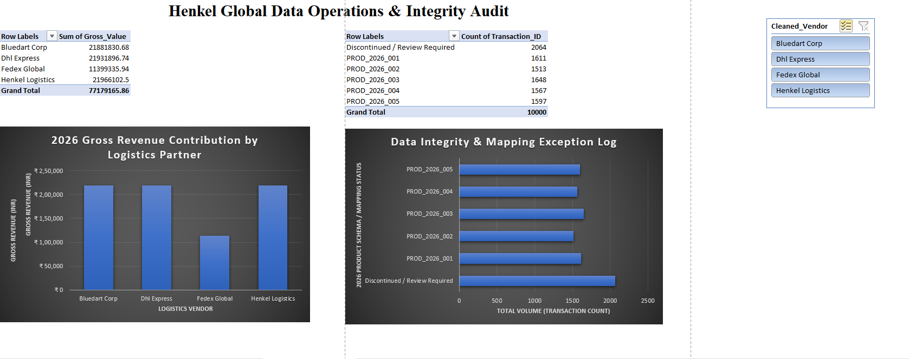

# 📊 Global Logistics Master Data Mapping & Quality Audit
**Context**: Henkel Data Operations Simulation (2026 Refresh Cycle)  
**Tech Stack**: Microsoft Excel (Advanced Lookups, Power Query, Dynamic Pivot Architectures, Interactive Slicers), Python (Pandas)

## 🎯 Project Overview
This project simulates a high-volume corporate data-refresh migration. It ingests a raw, unverified operational dataset containing **10,000 global logistics transactions** plagued by severe text formatting irregularities and deprecated system keys. The developed workbook builds an automated Extract-Transform-Load (ETL) pipeline within Excel to cleanse transaction fields, re-map legacy inventory structures to a standardized 2026 product schema, and flag tracking exceptions via an interactive control dashboard.

---

## 📈 Executive Insights Dashboard

*Figure 1: Complete production-grade data operations canvas optimized with hidden gridlines, custom axis titles, and structured grid tracking.*

### Metrics Captured:
* **Revenue Contribution Chart**: Tracks gross monetary performance across logistics carriers, isolating top spend velocities (e.g., DHL Express and BlueDart Corp driving over ₹21M each).
* **Data Integrity Log**: Monitors active exception points on the fly, visualizing the precise breakdown of active SKUs vs. unmapped tracking failures.

---

## 🛠️ Data Pipeline Architecture & Formulas Used

### 1. Text Standardization & Boundary Cleaning
Raw vendor data inputs contained erratic mixed-casing structures (e.g., `henkel logistics`, `BLUEDART CORP`) along with destructive hidden trailing whitespace. 
* **Formula Implemented**: `=PROPER(TRIM(C2))`
* **Outcome**: Standardized strings into uniform title-case entries, allowing aggregate systems to recognize unique partners without generating duplicate records.

### 2. Schema Translation & Exception Logging (The 2026 Refresh Cycle)
Raw shipping sheets utilized a legacy catalog format (`Legacy_Product_ID`) that needed mapping onto the official corporate standard sheet (`Product_Master_2026`).
* **Formula Implemented**: `=IFERROR(XLOOKUP(D2, Product_Master_2026!B:B, Product_Master_2026!A:A), "Discontinued / Review Required")`
* **Outcome**: Instantly mapped old assets to 2026 tracking codes. This architecture successfully isolated **2,064 structural anomalies** where transaction keys pointed to retired inventory, outputting a clear textual review flag rather than breaking formulas.

### 3. Financial Cost Attribution
Directly linked verified asset schemas back to factory manufacturing margins to generate Cost of Goods Sold (COGS) reporting.
* **Formula Implemented**: `=IFERROR(XLOOKUP(H2, Product_Master_2026!A:A, Product_Master_2026!D:D), 0)` followed by calculation `=Units_Shipped * Unit_Cost`

