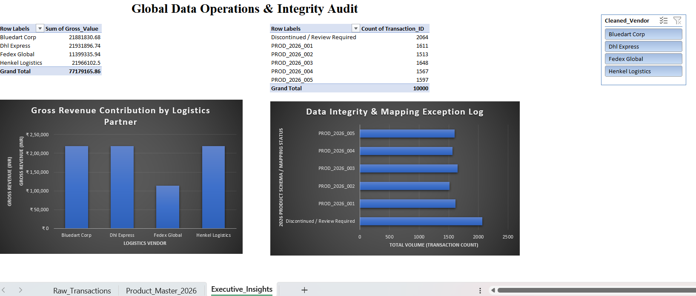

# 📊 Global Logistics Master Data Mapping & Quality Audit
**Tech Stack**: Microsoft Excel (Advanced Lookups, Power Query, Dynamic Pivot Architectures, Interactive Slicers), Python (Pandas)

## 🎯 Project Overview
This project simulates a high-volume corporate data migration and database optimization cycle. It ingests a raw, unverified operational dataset containing **10,000 global transport rows** plagued by severe text formatting irregularities and deprecated inventory system keys. The developed workbook builds an automated Extract-Transform-Load (ETL) pipeline within Excel to cleanse transaction fields, re-map legacy inventory structures to a standardized modern product catalog, and isolate pipeline tracking exceptions via an interactive dashboard.

---

## 📈 Executive Insights Dashboard

*Figure 1: Complete production-grade data operations canvas optimized with custom axis titles, structured grid tracking, and hidden gridlines.*

### Key Insights Tracked:
* **Revenue Contribution Chart**: Measures the gross financial volume handled across key logistics carriers, isolating specific carrier sales velocities (e.g., BlueDart Corp driving over ₹2,20,000 in transaction value).
* **Data Integrity Log**: Monitors operational exception points on the fly, visualizing the precise distribution of verified SKUs against active mapping failures.

---

## 🛠️ Data Pipeline Architecture & Formulas Used

### 1. Text Standardization & Boundary Cleaning
Raw vendor input data contained erratic mixed-casing structures (e.g., `DHL Express`, `dhl express `, `BLUEDART CORP`) along with destructive hidden trailing whitespace. 
* **Formula Implemented**: `=PROPER(TRIM(C2))`
* **Outcome**: Standardized raw strings into uniform title-case entries, allowing downstream aggregate systems to accurately recognize unique partners without generating duplicate data tracks.

### 2. Schema Translation & Exception Logging
Raw shipping logs utilized an outdated catalog format (`Legacy_Product_ID`) that required mapping onto an official standardized product catalog sheet (`Product_Master_2026`).
* **Formula Implemented**: `=IFERROR(XLOOKUP(D2, Product_Master_2026!B:B, Product_Master_2026!A:A), "Discontinued / Review Required")`
* **Outcome**: Instantly mapped historical assets to the active master catalog codes. This validation layer successfully trapped **2,064 structural anomalies** where shipping codes pointed to retired or missing entries, writing a clear review flag instead of throwing formula breaking errors (`#N/A`).

### 3. Financial Cost Attribution (COGS)
Directly linked verified inventory schemas back to internal manufacturing margins to evaluate Cost of Goods Sold (COGS) metrics across the entire 10,000-row database.
* **Formula Implemented**: `=IFERROR(XLOOKUP(H2, Product_Master_2026!A:A, Product_Master_2026!D:D), 0)` followed by calculation `=Units_Shipped * Unit_Cost`
